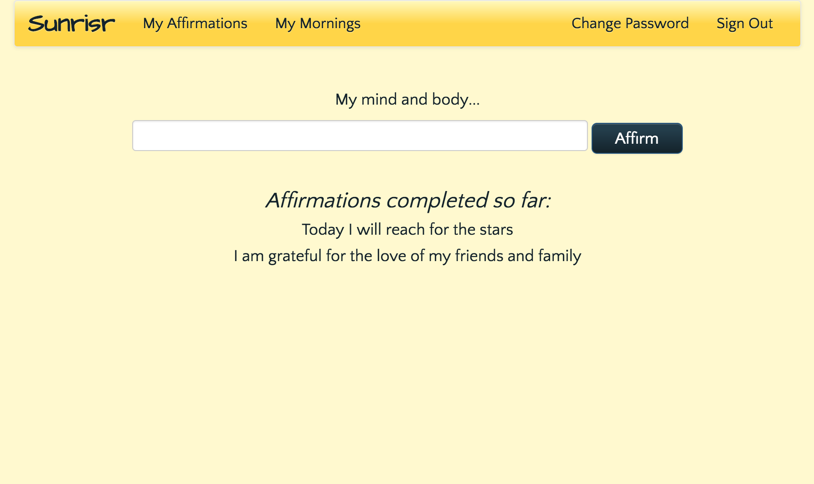

# Sunrisr

Many websites offer long lists of positive, uplifting affirmation statements.

There are even a few apps that, via scheduled notifications, will regularly remind you of your favorite affirmations.

I love browsing through sites like these. They fill me with inspiration. But when I went looking for a particular feature, one that's critical for anyone seeking self-improvement, I found that every site lacked it.

There's no interaction. None of the affirmation sites I've come across make you _do_ anything.

An inspiring message, flashed across the screen, can give you the momentary boost you need. But people aren't very good at retaining things by just reading them. If you want a message to really sink in, you need to engage with it in some way.

That's why I built Sunrisr: the only app that lets you customize a list of personal affirmations, then prompts you to *write them out every morning.*

## Screenshots

Here is a sample of what the deployed app looks like:

## Technology

The front end is built with Ember. The back end ([repository here](https://github.com/kopius/sunrisr-api)) is a Rails API. Both make use of [ActiveModel Serializer \& Adapter](https://github.com/rails-api/active_model_serializers) to maintain consistent formatting of request and response data. Client dependencies are managed with NPM and Bower.

## Development

My approach to build Sunrisr began with building out the API. I had a good idea of how I wanted to model data, and I knew Ember would be easier to use if I kept my routes flat instead of nesting resources on the back end. Once I had all the endpoints built and tested, I populated a development database with some sample data and began building out the client.

The most important feature in the client is a user's ability to perform their morning affirmations. I concentrating on building the view states and logic for the that flow first, in case the desired experience necessitated changes to my data model. The data model held up well during this stage of development, so once a user could peform their daily routine with pre-populated affirmations, it was comparatively easy to build the affirmation-management view where users customize their own list.

Once these two primary branches were complete, I added some guidance for new users, including a button that redirects from morning affirmations to affirmation management when the user hasn't written any affirmations yet. Finally, I applied some basic styling to make the app feel like a place for inspiration and personal growth.

#### Development Materials

These materials offer further insight into the development process for Sunrisr:

[User Stories](documentation/stories.md) | [Wireframes](documentation/wireframes) | [Pitch Deck](https://docs.google.com/presentation/d/1JXCFxPqAxTOI0RgLTNoGPi6L78I-G-uLxZdpLkD7kK0/edit?usp=sharing)

## Next Steps

In future versions of Sunrisr, I plan to focus on two additional features:

#### Tutorial / Improved UX

Sunrisr currently has a very simple UI, and only offers basic guidance to shepherd new users through the interface. In future versions, I'd like to improve the overall user experience by offering a tutorial, clearer calls to action, and a library of existing morning affirmations to browse for ideas.

#### Affirmation History

Sunrisr's data model already offers the ability to track users' history of successfully completing their daily affirmation. I would like to leverage this information into a dashboard view where users can see a visual representation of how consistently they're affirming
